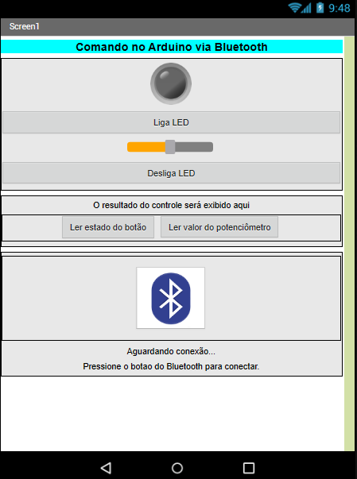

# AndroidBluetooth

Este projeto permite a comunicação entre um dispositivo Android e um Arduino via Bluetooth. Com ele, você pode controlar componentes eletrônicos conectados ao Arduino, como LEDs e potenciômetros, diretamente do seu dispositivo Android.

O projeto inclui o código-fonte do aplicativo Android, desenvolvido usando o MIT App Inventor 2, e o código-fonte do Arduino, que pode ser carregado no Arduino usando o Arduino IDE.

## Recursos

- Ligar e desligar um LED conectado ao Arduino
- Ajustar o brilho de um LED PWM conectado ao Arduino
- Ler o valor de um potenciômetro conectado ao Arduino
- Ler o estado de um botão conectado ao Arduino

## Instalação

Para instalar o projeto, siga estas etapas:

1. Clone este repositório para o seu computador.
2. Abra o arquivo `src/AndroidApp/ArduinoBluetooth.aia` no MIT App Inventor 2 e siga as instruções para compilar e instalar o aplicativo no seu dispositivo Android.
3. Abra o arquivo `src/ArduinoBluetooth/ArduinoBluetooth.ino` no Arduino IDE e carregue-o no seu Arduino.

## Uso

Para usar o projeto, siga estas etapas:

1. Conecte os componentes eletrônicos ao seu Arduino de acordo com o esquema de conexão fornecido no código-fonte do Arduino.
2. Inicie o aplicativo ArduinoBluetooth no seu dispositivo Android.
3. Use o aplicativo para se conectar ao seu Arduino via Bluetooth (A senha padrão é 1234).
4. Use os controles no aplicativo para enviar comandos ao Arduino e controlar os componentes conectados.

## Capturas de tela

## Documentação

Você pode encontrar mais documentação sobre o projeto na pasta `docs`:

- `APP Inventor - Acionamento no Arduino - Portas digitais e analógicas - Sandro.pdf`: Um tutorial sobre como usar o MIT App Inventor 2 para criar aplicativos Android que se comunicam com o Arduino via Bluetooth.
- `Tutorial comunicação PC_Arduino usando o módulo HC05 Bluetooth.pdf`: Um tutorial sobre como usar o módulo HC05 Bluetooth para estabelecer comunicação serial entre um PC e um Arduino.

## Contribuindo

Contribuições são bem-vindas! Se você deseja contribuir para este projeto, sinta-se à vontade para enviar um pull request.

## Licença

Este projeto está licenciado sob a licença MIT. Consulte o arquivo [License](LICENSE) para obter mais informações.

## Contato

Se você tiver dúvidas ou comentários sobre este projeto, entre em contato conosco.